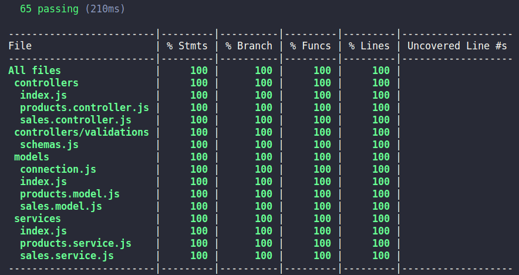

# Projeto API Store Manager - Arquitetura MSC

## Contexto
Está é uma API para gerenciamento de produtos e vendas, foi desenvolvida durante meus estudos de Back-end na __Trybe__ com o objetivo de consolidar os estudos de __Arquitetura de Software__. A API foi desenvolvida com __NodeJs__ e utiliza a arquitetura MSC: Model, Service e Controller. Os testes da aplicação utiliza as bibliotecas __Sinon, Mocha e Chai__.

Todos os códigos contidos nos diretórios __src__ e __tests__ foram desenvolvidos por mim, com exceção do arquivo dbUtils.js, que foi fornecido pela __Trybe__, utilizado para popular o banco de dados.

## Arquitetura da API
```
│   package-lock.json
│   package.json
│   ...
├───src
│   │   app.js
│   │   server.js
│   ├───controllers
│   │      └───validations
│   │             schemas.js
│   │      index.js
│   │      products.controller.js
│   │      sales.controller.js
│   ├───middlewares
│   │      validateProductName.js
│   │      validateSales.js
│   ├───models
│   │      index.js
│   │      connection.js
│   │      products.model.js
│   │      sales.model.js
│   ├───servicess
│   │      index.js
│   │      products.service.js
│   │      sales.service.js
│   ├───routes
│   │      products.router.js
│   │      sales.router.js
│   └───utils
│          dbUtils.js
│          errorMap.js
```

## Rotas

Através dessa API é possível criar, ler, atualizar e deletar informações de produtos e vendas. A relação de rotas e suas respectivas descrições podem ser visualizadas nas tabelas abaixo.

### Produtos
|Método|Rota|Descrição|
|-|-|-|
|GET|/products|retorna todos os produtos|
|GET|/products/:id|retorna o produto especificado|
|GET|/products/search?q=QUERY|retorna o produto com o nome correspondente|
|POST|/products|registra um novo produto|
|PUT|/products/:id|atualiza um produto|
|DELETE|/products/:id|remove um produto|

<details>
<summary>Como utilizar as rotas que possuem body</summary>

1. Registro de novo produto

  - O corpo da requisição deverá seguir o formato abaixo:
  
  ```js
  {
    "name": "Produto x"
  }
  ```

2. Atualização de produto
  - O corpo da requisição deverá seguir o formato abaixo:
  
  ```js
  {
    "name": "Novo nome"
  }
  ``` 
</details>

### Vendas
|Método|Rota|Descrição|
|-|-|-|
|GET|/sales|retorna os dados de todas as vendas|
|GET|/sales/:id|retorna os dados de uma venda específica|
|POST|/sales|registra uma nova venda|
|PUT|/sales/:id|atualiza uma venda|
|DELETE|/sales/:id|remove uma venda|

<details>
<summary>Como utilizar as rotas que possuem body</summary>

1. Registro de novas vendas

  - O corpo da requisição deverá seguir o formato abaixo:
  
  ```js
  [
    {
      "productId": 1,
      "quantity": 1
    },
    {
      "productId": 2,
      "quantity": 5
    }
  ]
  ```

1. Atualização de vendas
  - O endpoint deve ser acessível através do caminho (/sales/:id);
  - O corpo da requisição deverá seguir o formato abaixo:
  
  ```js
  [
    {
      "productId": 1,
      "quantity": 10
    },
    {
      "productId": 2,
      "quantity": 50
    }
  ]
  ```

2. Atualização de produto
  - O corpo da requisição deverá seguir o formato abaixo:
  
  ```js
  {
    "name": "Novo nome"
  }
  ``` 
</details>

## Técnologias utilizadas
- Desenvolvido com: __NodeJs__, __Express__
- Banco de dados: __MySQL__
- Testes: __Sinon__, __Mocha__, __Chai__
- Validações: __Yup__

## Instalação

O repositório conta com um arquivo docker-compose já configurado para maior comodidade e replicabilidade.

Siga os passos a seguir para ter a aplicação rodando em sua máquina.

1. Clonando o repositório
  ```sh
    git clone git@github.com:brunofpessoa/API-store-manager-MSC.git
  ```
2. Instalando as dependências
  ```sh
    cd API-store-manager-MSC
  ```
  ```sh
    npm install
  ```
3. Subindo os containers
No diretório raiz do projeto execute o seguinte comando para inicializar os containers
  ```sh
    docker-compose up -d
  ```
4. Criando e populando o banco de dados
  ```sh
    docker exec -it store_manager bash
  ```
  ```sh
    npm run populate
  ```
5. Inicializando o servidor
  Inicie o servidor
  ``` sh
    npm start
  ```
  ou
  ``` sh
    npm run debug
  ```
> Você pode configurar as variáveis de ambiente conforme o arquivo .env.exemple se desejar utilizar outras credenciais, portas etc.

A aplicação está no ar! utilize o navegador ou um outro cliente como Thunder Client para acesse as rotas conforme descrito na seção _Rotas_ deste documento.

## Testes da aplicação

Toda a aplicação é coberta por testes unitários, para testar a aplicação acesse o terminal do container store_manager com o comando `docker exec -it store_manager bash` e em seguida execute `npm test`

O seu terminal deve exibir um resultado parecido com esse:



> Os testes foram desenvolvidos com Sinon, Mocha e Chai.

## Contribua com o projeto
Se você tiver uma sugestão para melhorar isso, faça um fork do repositório e faça um _pull request_. Você também pode simplesmente abrir um problema com a tag "enhancement". Não se esqueça de dar uma estrela ao projeto! Obrigado novamente!

1. Faça um Fork do projeto
2. Cria sua Feature Branch (git checkout -b feature/AmazingFeature)
3. Confirme suas alterações (git commit -m 'Add some AmazingFeature')
4. Publique sua branch (git push origin feature/AmazingFeature)
5. Abra o Pull Request

## Contato

Email: `brunofernpessoa@gmail.com`

[LinkedIn](https://www.linkedin.com/in/brunofpessoa/)

[GitHub](https://github.com/brunofpessoa/)
